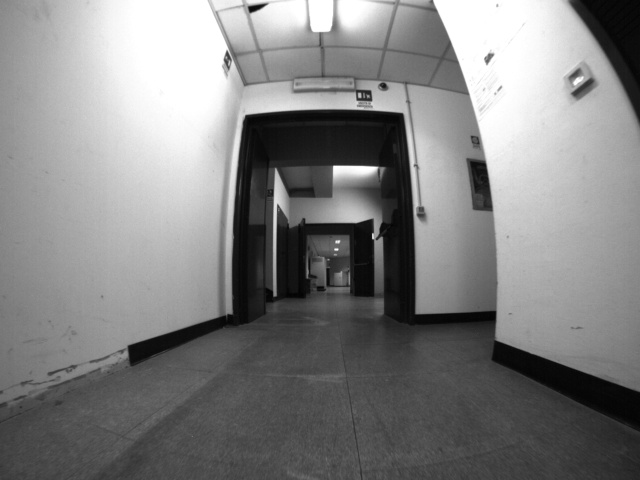
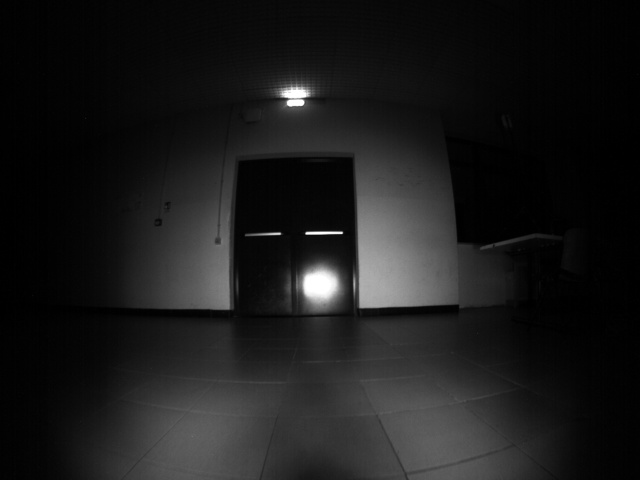
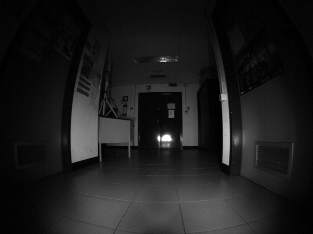
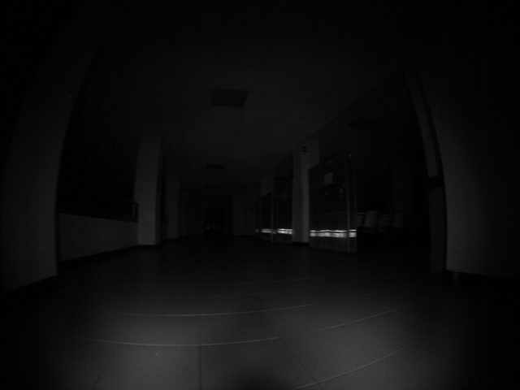
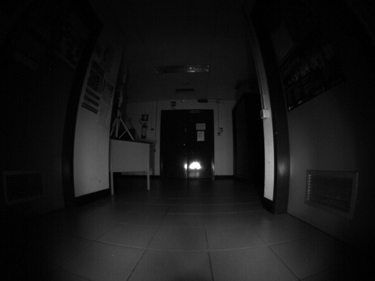
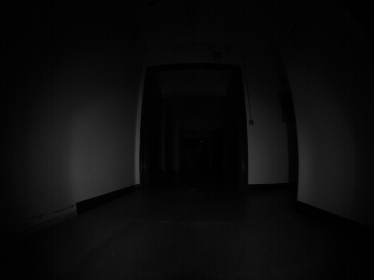
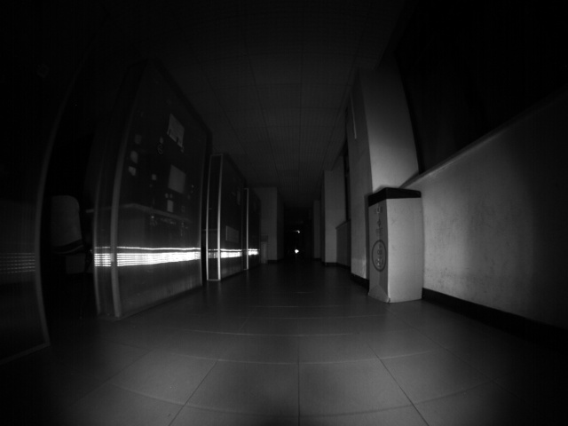

## LUCID - Lighting Up Campus Indoor Spaces Dataset
 **LUCID** has been made using a modified Pioneer3-DX robot, equipped with a monocular camera, LED bars, and a lux meter,
specifically designed to study the performance of VO/V-SLAM monocular algorithms in dark indoor scenarios 
where the only light source is provided by an auxiliary lighting source. </br>
**LUCID** was created as part of a study investigating the performance of two state-of-the-art (SOTA) V-SLAM algorithms, 
Direct Sparse Odometry (DSO) and ORB-SLAM3 (OS3), in their monocular implementation, in dark indoor scenarios. 

**Open Access Paper**: [https://onlinelibrary.wiley.com/doi/10.1002/rob.22595](https://onlinelibrary.wiley.com/doi/10.1002/rob.22595)

<br clear="left"/> 

## Changelog

***28, May 2025 update***</br> 
Repository under construction, we are uploading and building the github repo.  </br></br>
***10, June 2025 update***</br> 
- Public data uploading: we started uploading dataset, some scenarios are available but parts are missing. 
- URL for data is available [Here](http://sira.diei.unipg.it/supplementary/public/Datasets/LUCID/)
- Readme updated with the Architecture of the LUCID Dataset

# Overview
LUCID dataset consists of more than 159 sequences (original and enhanced) acquired in three distinct indoor scenarios and 
includes:

- Image sequences at various levels of PWM light source intensity.
- Image sequences paired with the enhanced version, processed using a Generative Adversarial Network (GAN) (EnlightenGAN).
  to simulate various levels of image enhancement.
- GT trajectories for each sequence obtained with a 2D LiDAR.
- Maps of the scenarios (occupancy grids) used to localize and plan the trajectories.


<table>
  <tr>
   <th colspan="1">P3DX ROBOT</th>
   <th colspan="4">LUCID Images Examples</th>
  </tr>

  <tr>
    <th rowspan="3" style="align-items: center"> <br/></th>
    <tr>
      <td style="align-items: center">  </td>
      <td style="align-items: center">  </td>
      <td style="align-items: center">  </td>
      <td style="align-items: center">  </td>
    </tr>
    <tr>
      <td style="align-items: center">  </td>
      <td style="align-items: center">  </td>
      <td style="align-items: center">  </td>
      <td style="align-items: center">  </td>
    </tr>
</table>


## Dataset Structure

The LUCID dataset is hierarchically organized and follows the [Monocular Visual Odometry Dataset](https://cvg.cit.tum.de/data/datasets/mono-dataset) data format.
It consists of more than 159 sequences (original and enhanced) acquired in three distinct indoor scenarios: 
1. "Corridor_A", 
2. "Corridor_B", 
3. "Hall".


For each sequence, the following data are provided:
* **Raw Images**: Raw image stream from the monocular camera.
* **Ground Truth (GT) Trajectories**: Ground truth trajectories (robot poses) obtained using a 2D LiDAR and the A-MCL SLAM algorithm.
* **Camera Calibration Data**: Intrinsic parameters, photometric calibration, and vignetting information.
* **Light Intensity Measurements**: Data from the lux meter recording incident light intensity.
* **PWM Power Levels**: The Pulse Width Modulation (PWM) value used to control the intensity of the robot's auxiliary LED bars.
* **Enhanced Sequences**: Versions of the original sequences processed by the EnlightenGAN network to simulate image enhancement in low-light conditions.
* **Rosbag Files**: The original rosbag files for each sequence, providing a synchronized recording of data for reproducibility and analysis.
* **2D Maps (Hall, Corridor_A, Corridor_B)**: 2D occupancy grid maps of the scenarios obtained through laser scans.

### Folder Organization (Example)
### 4.3 Data organization

```shell
LUCID
├── Lens_Calibrations.zip
│
├── Corridor_A_ROS.zip
│       ├── . . . 
│       ├── Corridor_A_L0_T1.bag
│       ├── . . .
│       ├── Corridor_A_D_255_T3.bag
│       └── . . .
├── Corridor_B_ROS.zip
├── Hall_ROS.zip
│
├── Corridor_A.zip
├── Corridor_B.zip
└── Hall.zip
        ├── map_gt.zip
        │       ├── Hall.pgm
        │       ├── Hall.png
        │       └── Hall.yaml
        │
        ├── trajectories.zip
        │       ├── Hall_L0_T1/
        │       ├── . . . 
        │       ├── Hall_D_40_T3/
        │       │       ├── Hall_D_40_T3_GT.txt
        │       │       ├── Hall_D_40_T3_DSO.txt
        │       │       └── Hall_D_40_T3_ORB.txt
        │       ├── Hall_D_40_T3_ENH/
        │       └── . . .
        │
        └── Datasets.zip
                └── TUM_Format
                        ├── Hall_L0_T1/ 
                        ├── . . .          
                        ├── Hall_D_40_T3/
                        │   ├── camera.txt
                        │   ├── Hall_D_40_T3_GT.txt
                        │   ├── images/
                        │   │   ├── 00001.jpg
                        │   │   ├── ….
                        │   │   └── 08136.jpg
                        │   ├── lumens.txt
                        │   ├── pcalib.txt
                        │   ├── times.txt
                        │   └── vignette.png
                        │
                        ├── Hall_D_40_T3_ENH/
                        ├── . . .
                        ├── Hall_D_255_T3/
                        └── Hall_D_255__ENH/
```


## License
ARD-VO is released under the following License:

Attribution-NonCommercial-ShareAlike 3.0 [CC BY-NC-SA 3.0](LICENSE).

This means it is possible:
* to copy, distribute, display, and perform the work. 
* to make derivative works.

Under the following conditions:</br>
 - Attribution: You must give the original author credit.</br>
 - Non-Commercial — You may not use this work for commercial purposes. </br>
 - Share Alike — If you alter, transform, or build upon this work, you may distribute the resulting work only under a licence identical to this one.


