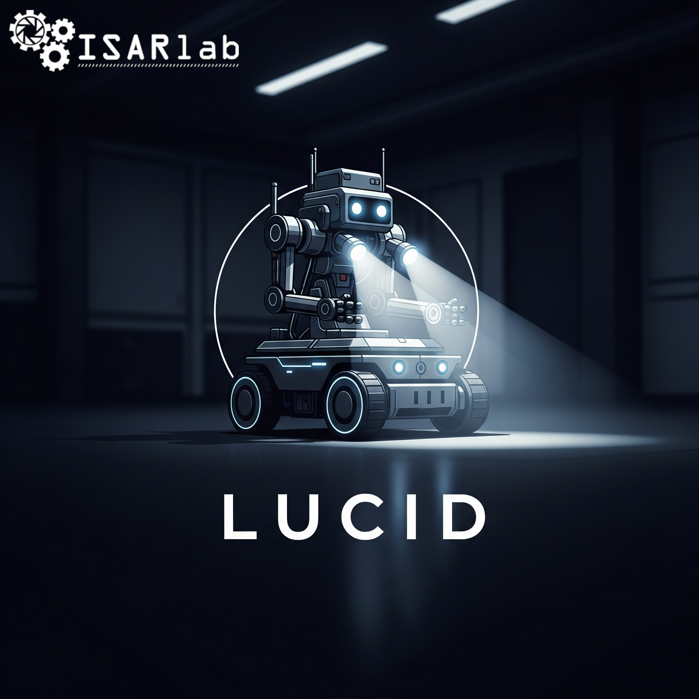


# LUCID - Lighting Up Campus Indoor Spaces Dataset
 **LUCID** has been made using a modified Pioneer3-DX robot, equipped with a monocular camera, LED bars, and a lux meter,
specifically designed to study the performance of VO/V-SLAM monocular algorithms in dark indoor scenarios 
where the only light source is provided by an auxiliary lighting source. <br/>
**LUCID** was created as part of a study investigating the performance of two state-of-the-art (SOTA) V-SLAM algorithms, 
Direct Sparse Odometry (DSO) and ORB-SLAM3 (OS3), in their monocular implementation.

**Open Access Paper**: [https://onlinelibrary.wiley.com/doi/10.1002/rob.22595](https://onlinelibrary.wiley.com/doi/10.1002/rob.22595)

<br clear="left"/> 


## 1.Overview
LUCID dataset consists of more than 159 sequences (original and enhanced) acquired in three distinct indoor scenarios and 
includes:

- Image sequences at various levels of PWM light source intensity.
- Image sequences paired with the enhanced version, processed using a Generative Adversarial Network (GAN) (EnlightenGAN).
  to simulate various levels of image enhancement.
- GT trajectories for each sequence obtained with a 2D LiDAR.
- Maps of the scenarios (occupancy grids) used to localize and plan the trajectories.


<table>
  <tr>
   <th colspan="2">P3DX ROBOT</th>
   <th colspan="5">LUCID Images Examples</th>
  </tr>
  <tr>
    <td rowspan="2" colspan="2" style="text-align: center;  vertical-align: middle;">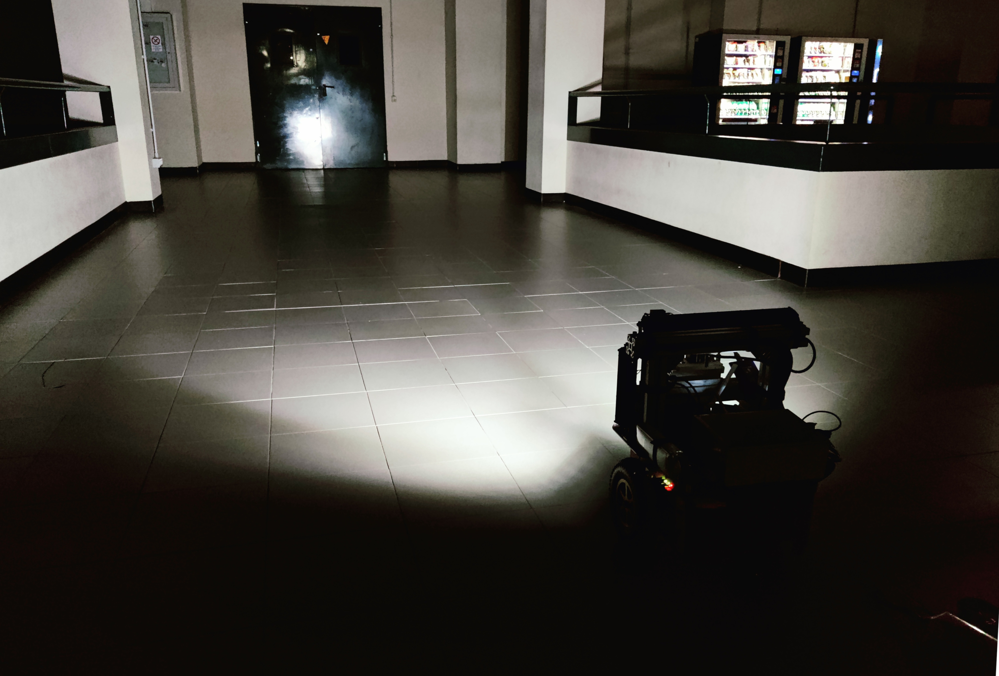 <br/></td>
      <td style="text-align: center;  vertical-align: middle;"> 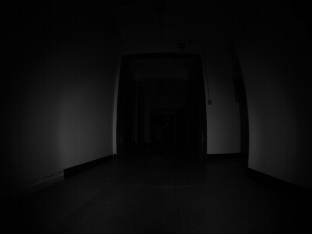 </td>
      <td style="text-align: center;  vertical-align: middle;"> 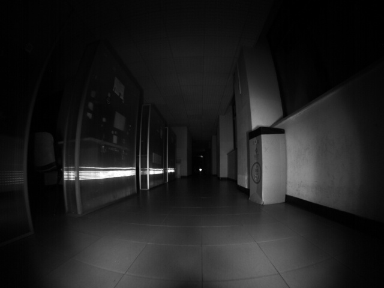 </td>
   <td rowspan="2" colspan="2" style="text-align: center;  vertical-align: middle;"> <br/></td>
    <tr>
      <td style="text-align: center;  vertical-align: middle;"> 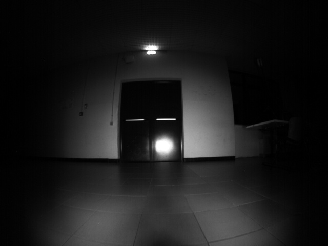 </td>
      <td style="text-align: center;  vertical-align: middle;"> 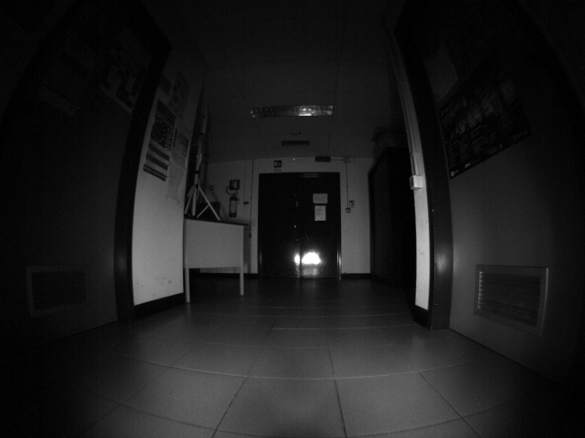 </td>
    </tr>
    <tr>
      <td style="text-align: center;  vertical-align: middle;"> 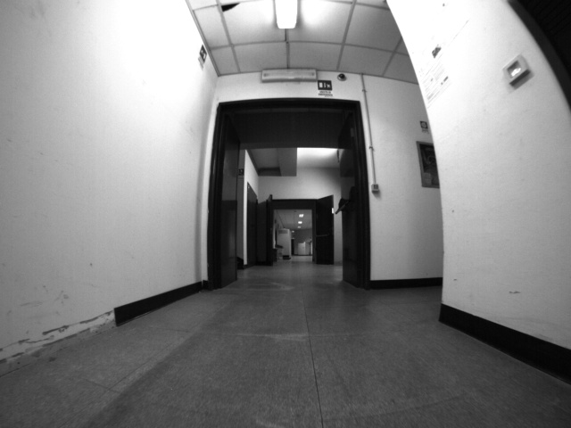 </td>
      <td style="text-align: center;  vertical-align: middle;"> 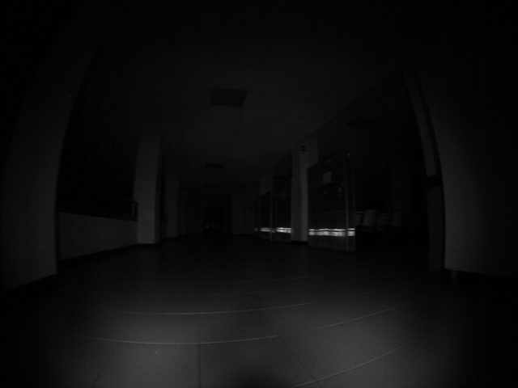 </td>
      <td style="text-align: center;  vertical-align: middle;">  </td>
      <td style="text-align: center;  vertical-align: middle;">  </td>
      <td style="text-align: center;  vertical-align: middle;"> 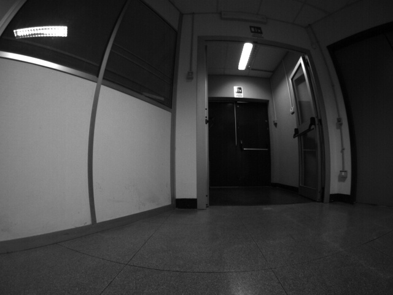 </td>
      <td style="text-align: center;  vertical-align: middle;"> 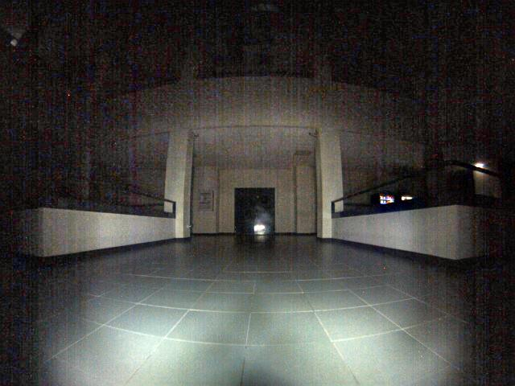 </td>
    </tr>
</table>


## 2.Scenarios
The LUCID dataset is hierarchically organized and follows the [TUM Monocular Visual Odometry Dataset](https://cvg.cit.tum.de/data/datasets/mono-dataset) format.
It consists of more than 159 sequences (original and enhanced) acquired in three distinct indoor scenarios within the
Department of Engineering, University of Perugia, Italy. 
These scenarios were selected based on criteria such as path length and complexity, texture richness, and navigability space.


| LUCID Scenario | # Sequences | Avg. length [m] | Loop Closing |
|----------------|-------------|-----------------|--------------|
| Corridor_A     | 49          | 31.1826         | ✗            |
| Corridor_B     | 61          | 28.3467         | ✗            |
| Hall           | 49          | 122.6096        | ✓            |


- The first two scenarios, labeled "**Corridor_A**" and "**Corridor_B**," are transit areas to reach offices and
laboratories. They represent most of the way to the mission destination in real indoor scenarios.
- The third scenario, "**Hall**", is one floor of a comprehensive space between different buildings, comprising two main 
areas connected by two hallways, with desks and chairs.

  
<table>

  <tr>
    <th rowspan="1" style="text-align: center;  vertical-align: middle;">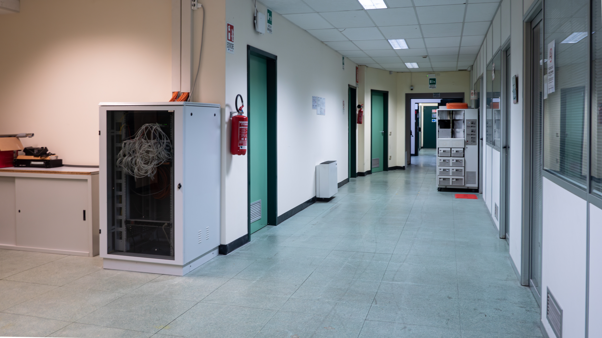 <br/></th>
    <th rowspan="1" style="text-align: center;  vertical-align: middle;">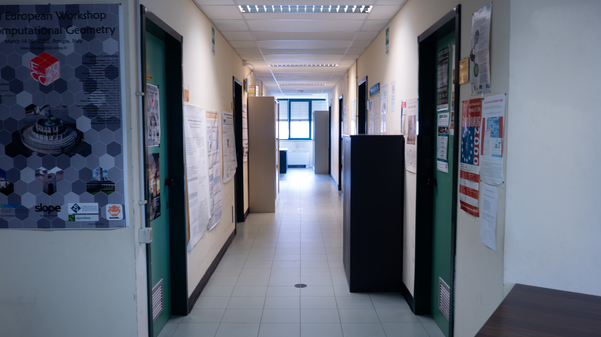 <br/></th>
    <th rowspan="1" style="text-align: center;  vertical-align: middle;"> <br/></th>
    
  </tr>
  <tr>
    <th rowspan="1" style="text-align: center;  vertical-align: middle;">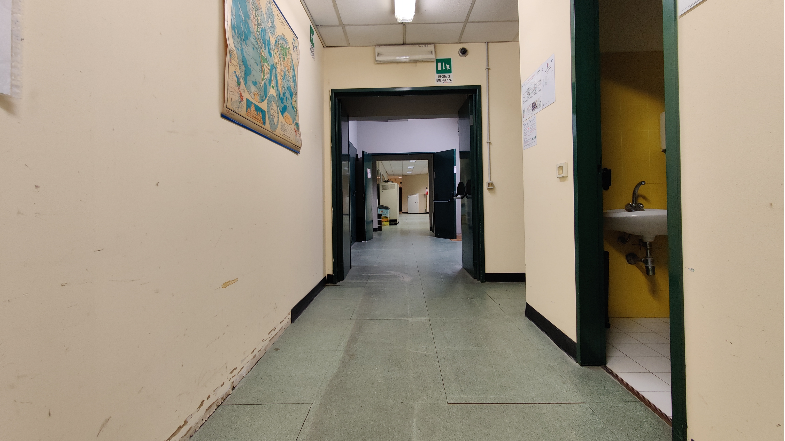 <br/></th>
    <th rowspan="1" style="text-align: center;  vertical-align: middle;">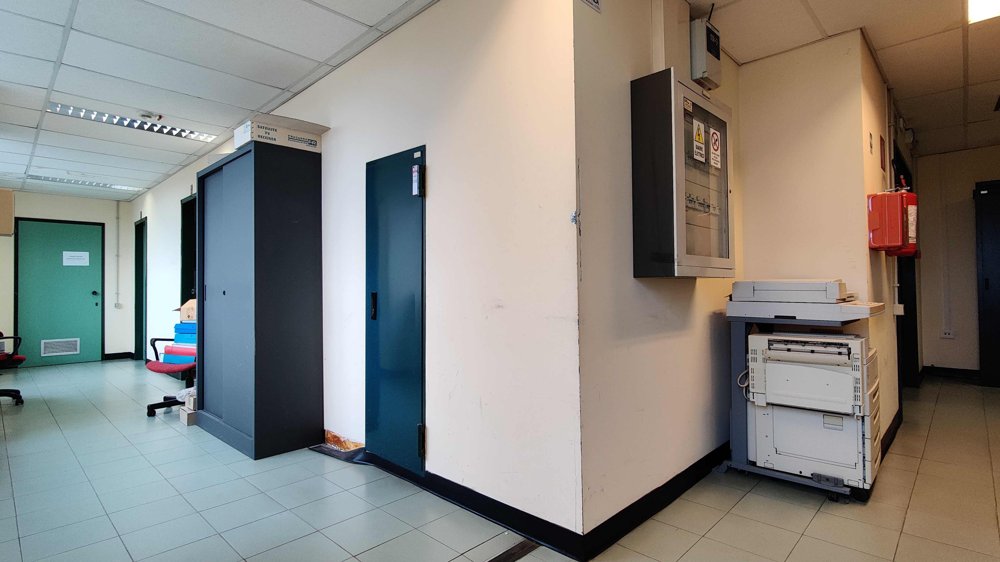 <br/></th>
    <th rowspan="1" style="text-align: center;  vertical-align: middle;">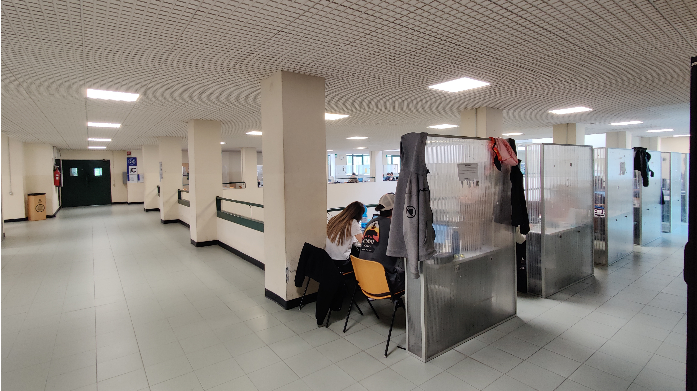 <br/></th>
</tr>
  <tr>
    <th rowspan="1" style="text-align: center;  vertical-align: middle;">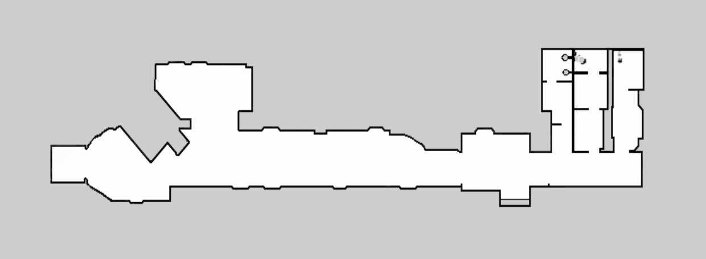 <br/></th>
    <th rowspan="1" style="text-align: center;  vertical-align: middle;">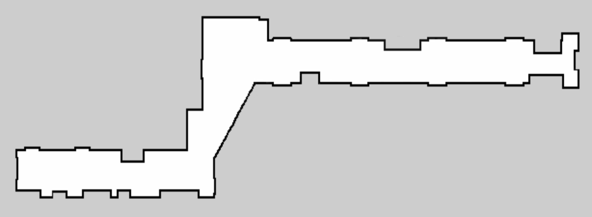 <br/></th>
    <th rowspan="1" style="text-align: center;  vertical-align: middle;">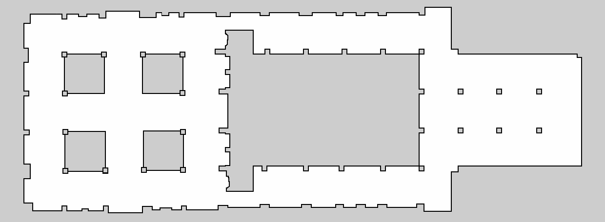 <br/></th>
  </tr>
  <tr>  
    <th style="text-align: center;  vertical-align: middle;"> Corridor_A</th>
    <th style="text-align: center;  vertical-align: middle;"> Corridor_B</th>
    <th style="text-align: center;  vertical-align: middle;"> HALL</th>
  </tr>

</table>


## 3.Data

For convenience the dataset has been organized and compressed in three types of archives (.zip):
1. **ScenarioXXX.zip**: Containing all the sequences (PWMs and Enhanced Version), GT trajectories, sensors data and Maps
   - "Corridor_A" and "Corridor_B" archives also contain the trajectories for all the sequences obtained with 
   [ORBSLAM3](https://github.com/UZ-SLAMLab/ORB_SLAM3) and [DSO](https://github.com/JakobEngel/dso)
2. **Lens_Calibration.zip**: Intrinsics Camera calibration Files, computed with the [Kalibr](https://github.com/ethz-asl/kalibr) Tool.
3. **ScenarioXXX_ROS.zip**: The Raw rosbag files, with aligned timestamps of all the sequence.
<table>
  <thead>
    <tr>
      <th>Data Download</th>
      <th>Description</th>
      <th>Size</th>
    </tr>
  </thead>
  <tbody>
    <tr>
      <td><a href="http://sira.diei.unipg.it/supplementary/public/Datasets/LUCID/Corridor_A.zip" target="_blank" rel="noopener noreferrer">Corridor_A.zip</a></td>
      <td>LUCID dataset: Corridor_A sequences, GT + ORB/DSO trajectories + Lux data</td>
      <td>~4.3G</td>
    </tr>
    <tr>
      <td><a href="http://sira.diei.unipg.it/supplementary/public/Datasets/LUCID/Corridor_B.zip" target="_blank" rel="noopener noreferrer">Corridor_B.zip</a></td>
      <td>LUCID dataset: Corridor_B sequences + GT + ORB/DSO trajectories + Lux data</td>
      <td>~8.7G</td>
    </tr>
    <tr>
      <td><a href="http://sira.diei.unipg.it/supplementary/public/Datasets/LUCID/Hall.zip" target="_blank" rel="noopener noreferrer">Hall.zip</a></td>
      <td>LUCID dataset: Hall sequences + GT trajectories + Lux data</td>
      <td>~19G</td>
    </tr>
    <tr>
      <td><a href="http://sira.diei.unipg.it/supplementary/public/Datasets/LUCID/Corridor_A_ROS.zip" rel="noopener noreferrer">Corridor_A_ROS.zip</a></td>
      <td>Rosbags of Corridor_A sequences</td>
      <td>~27G</td>
    </tr>
    <tr>
      <td><a href="http://sira.diei.unipg.it/supplementary/public/Datasets/LUCID/Corridor_B_ROS.zip" target="_blank" rel="noopener noreferrer">Corridor_B_ROS.zip</a></td>
      <td>Rosbags of Corridor_B sequences</td>
      <td>~47G</td>
    </tr>
    <tr>
      <td><a href="http://sira.diei.unipg.it/supplementary/public/Datasets/LUCID/Hall_ROS.zip" target="_blank" rel="noopener noreferrer">Hall_ROS.zip</a></td>
      <td>Rosbags of Hall sequences</td>
      <td>~116G</td>
    </tr>
    <tr>
      <td><a href="http://sira.diei.unipg.it/supplementary/public/Datasets/LUCID/Lens_Calibrations.zip" target="_blank" rel="noopener noreferrer">Lens_Calibrations.zip</a></td>
      <td>Kalibr intrinsics calibration files</td>
      <td>~859K</td>
    </tr>
  </tbody>
</table>

If you want to explore the dataset remote directory:
 ```url
http://sira.diei.unipg.it/supplementary/public/Datasets/LUCID/
 ```
    
### 3.1 Robotic Platform

We employed a real-world robot with custom hardware for gathering data.

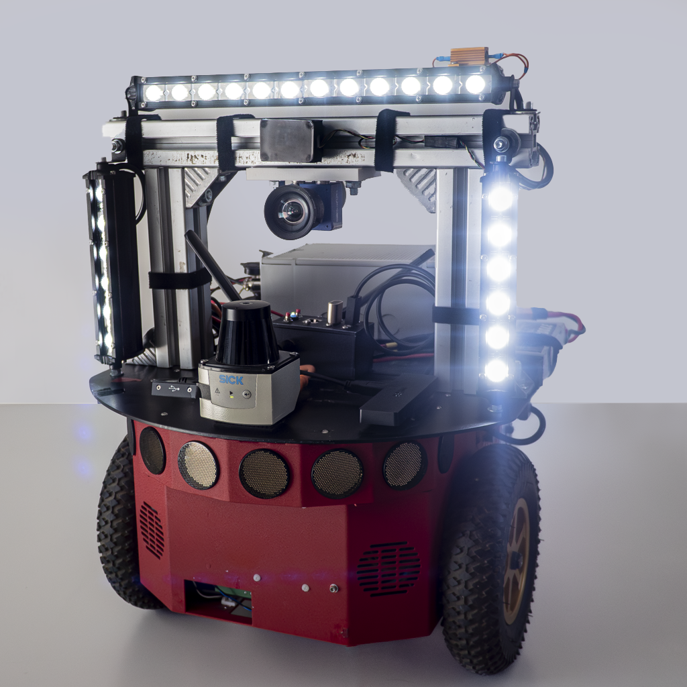

The main sensors and actuators involved with the dataset are:
 - Monocular Camera Module
 - Three light bars: Auxiliary light source, 8bit PWM controlled 0 -> 255 (0% -> 100% light intensity). 
 - Luxometer (Light sensor): mounted close to the camera lens to measure the incident light.
 - 2D LiDaR, used to:
   - navigate scenarios according to the planned waypointsught the scenario,
   - GT of the trajectories
   - 2D map creation

  The table below describes in detail Camera and Lighting devices.

| Device             | Description                                    |
|--------------------|------------------------------------------------|
| **Monocular Camera** |                                                |
| Sensor             | USB 3.0 mvBlueFOX3-1 global shutter            |
| Max Resolution     | 1280x1024 (1.3 megapixels)                     |
| Shutter Speed      | Max 120 Frames per Second (FPS)                |
| Image Format       | Mono8, ..., Mono16, Bayer8, ..., Bayer16, RGB, YUV |
| Lens               | C-mount, 5mm F1.8 fixed                        |
| **Lightening Rig** |                                                |
| LED Bars           | Left/Right 18 W, Center 36 W                   |
|                    | 60° beam, 6000 K ~ 6500 K light temperature    |
| Light Sensor       | BH1750 [0 lux, ..., 65000 lux]                 |
| Current Sensor     | 3 channels INA3221                             |
| Control Unit       | LHR - Light Handler Board (Custom)             |
| Communication      | LHR Serial @ 57600 Baud 8N1                    |

For each scenario and light condition, to make the results comparable, we fixed the recording parameters of the camera 
and the robot speed.
  
| Data Acquisition | Value              |
|------------------|--------------------|
| Robot Avg Speed  | 0.4 m/s            |
| Shutter Speed    | 39 ms              |
| Avg. FPS         | 24                 |
| Focus            | Fixed              |
| Focal Aperture   | F1.8               |
| Resolution       | BGR8 @ 640 × 480   |
| Image Format     | Jpeg               |


### 3.2 Data Collection 
Data collection was carried out to test the system's performance under changing conditions. 
For each scenario, multiple sequences of data were acquired, differentiated by the lighting level (PWM) and the trial number for each configuration.

The sequence names follow a specific syntax to clearly identify the experimental conditions:

    Scenario_LightCondition_PWMValue_TrialNumber
    Scenario_LightCondition_TrialNumber (for baseline lighting)

Here's a breakdown of the naming conventions:

* **Scenario**: Indicates the location (e.g., Hall, Corridor_A).
* **LightCondition**: Specifies the type of lighting used:
  * **L0**: Represents ideal, reference ambient lighting.
  * **D**: Denotes auxiliary artificial lighting.
    * **PWMValue**: (Applies to D condition) The Pulse Width Modulation value, ranging from 0 to 255, controlling the intensity of the auxiliary artificial light.
* **Tx**: The trial number (e.g., T1, T2, T3), indicating a repeated experiment under the same lighting and scenario conditions.
* **_ENH**: An optional suffix indicating an "Enhanced" condition, which implies specific additional processing or setup not explicitly detailed here but unique to that sequence.


| Sequence ID      | Scenario   | Light Condition | PWM Value | Trial | Description                                                            |
|------------------|------------|-----------------|-----------|-------|------------------------------------------------------------------------|
| Corridor_A_L0_T1 | Corridor_A | L (Light good)  | 0 PWM     | 1     | Ideal ambient light, Corridor_A, first trial                           |
| Corridor_A_L0_T2 | Corridor_A | L (Light good)  | 0 PWM     | 2     | Same condition of "Corridor_A_L0_T1", second trial                     |
| Hall_D_40_T3     | Hall       | D (Darkness)    | 40 PWM    | 3     | Darkness with auxiliary light at 40 PWM level (0<PWM<255), third trial |
| Hall_D_40_T3_ENH | Hall       | D (Darkness)    | 40 PWM    | 3     | Same sequence "Hall_D_40_T3", but images enhanced with EnligthenGAN    |

In the following table it is possible to notice for Corridor_A the images of different sequence at different PWM level and
enhancement processing.

<table>

  <tr>
    <th rowspan="1" style="text-align: center;  vertical-align: middle;">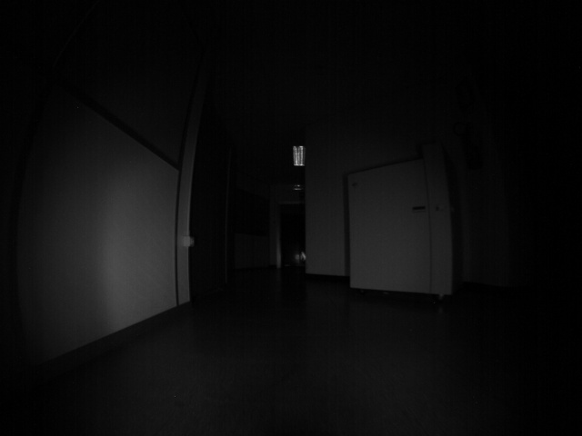 <br/></th>
    <th rowspan="1" style="text-align: center;  vertical-align: middle;">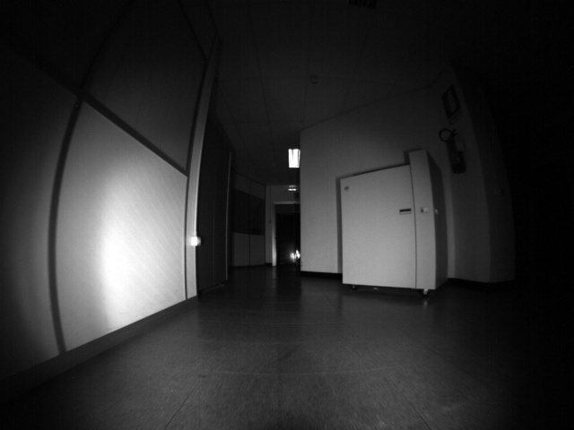 <br/></th>
    <th rowspan="1" style="text-align: center;  vertical-align: middle;">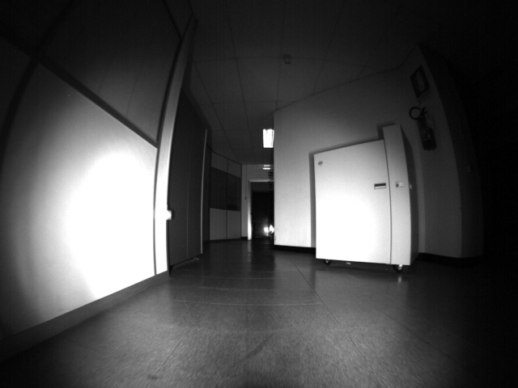 <br/></th>
    <th rowspan="1" style="text-align: center;  vertical-align: middle;">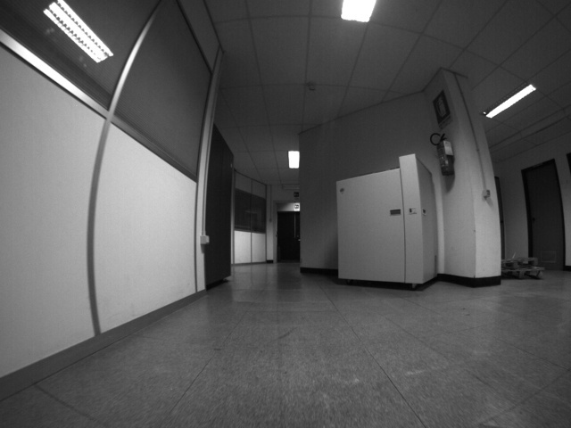 <br/></th>
    <th rowspan="1" style="text-align: center;  vertical-align: middle;">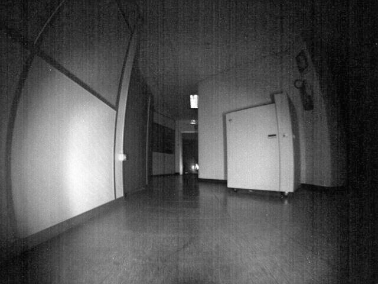 <br/></th>
    <th rowspan="1" style="text-align: center;  vertical-align: middle;">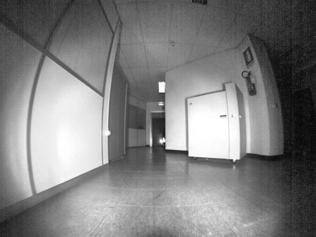 <br/></th>
    <th rowspan="1" style="text-align: center;  vertical-align: middle;">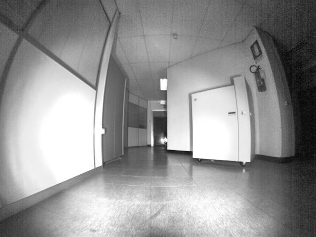 <br/></th>
  </tr>

  <tr>
  <th rowspan="1"> PWM 25</th>
  <th rowspan="1"> PWM 127</th>
  <th rowspan="1"> PWM 255</th>
  <th rowspan="1"> LIGHT</th>
  <th rowspan="1"> PWM 25 - ENH</th>
  <th rowspan="1"> PWM 127 - ENH</th>
  <th rowspan="1"> PWM 255 - ENH</th>
  </tr>

</table>


**the following data are provided:**

* **Raw Images**: Raw image stream from the monocular camera.
* **Ground Truth (GT) Trajectories**: Ground truth trajectories (robot poses) obtained using a 2D LiDAR and the A-MCL SLAM algorithm.
* **Camera Calibration Data**: Intrinsic parameters, photometric calibration, and vignetting information.
* **Light Intensity Measurements**: Data from the lux meter recording incident light intensity.
* **PWM Power Levels**: The Pulse Width Modulation (PWM) value used to control the intensity of the robot's auxiliary LED bars.
* **Enhanced Sequences**: Versions of the original sequences processed by the EnlightenGAN network to simulate image enhancement in low-light conditions.
* **Rosbag Files**: The original rosbag files for each sequence, providing a synchronized recording of data for reproducibility and analysis.
* **2D Maps (Hall, Corridor_A, Corridor_B)**: 2D occupancy grid maps of the scenarios obtained through laser scans.


### 3.3 DATA Organization 

```shell
LUCID
├── Lens_Calibrations.zip
│
├── Corridor_A_ROS.zip
│       ├── . . . 
│       ├── Corridor_A_L0_T1.bag
│       ├── . . .
│       ├── Corridor_A_D_255_T3.bag
│       └── . . .
├── Corridor_B_ROS.zip
├── Hall_ROS.zip
│
├── Corridor_A.zip
├── Corridor_B.zip
└── Hall.zip
        ├── map_gt.zip
        │       ├── Hall.pgm
        │       ├── Hall.png
        │       └── Hall.yaml
        │
        ├── trajectories.zip
        │       ├── Hall_L0_T1/
        │       ├── . . . 
        │       ├── Hall_D_40_T3/
        │       │       ├── Hall_D_40_T3_GT.txt
        │       │       ├── Hall_D_40_T3_DSO.txt
        │       │       └── Hall_D_40_T3_ORB.txt
        │       ├── Hall_D_40_T3_ENH/
        │       └── . . .
        │
        └── Datasets.zip
                └── TUM_Format
                        ├── Hall_L0_T1/ 
                        ├── . . .          
                        ├── Hall_D_40_T3/
                        │   ├── camera.txt
                        │   ├── Hall_D_40_T3_GT.txt
                        │   ├── images/
                        │   │   ├── 00001.jpg
                        │   │   ├── ….
                        │   │   └── 08136.jpg
                        │   ├── lumens.txt
                        │   ├── pcalib.txt
                        │   ├── times.txt
                        │   └── vignette.png
                        │
                        ├── Hall_D_40_T3_ENH/
                        ├── . . .
                        ├── Hall_D_255_T3/
                        └── Hall_D_255__ENH/
```

## 4 ROS1 

The navigation stack of the robotic platform is based on ROS1, which provides the rosbag tool to collect files containing
topics and messages. We included the bag files for each sequence to facilitate reproducibility and further research.
These ROS bags provide a synchronized record of the data, supporting experiment replay, synchronized data analysis, and the
development of new low-light VO/VSLAM algorithms. 

### 4.1 Topics
The recorded topics include:

| ROS Topic                          | Description                                                               |
|------------------------------------|---------------------------------------------------------------------------|
| `/bluefox_camera/image_raw`        | Raw image stream from the camera.                                         |
| `/bluefox_camera/shutter_speed`    | Camera shutter speed.                                                     |
| `/clock`                           | Clock signal for synchronization of different data streams.               |
| `/light_rig/sensors`               | Measurements from the light rig sensors (e.g., lux meter, PWM intensity). |
| `/tf`                              | Transformations between different coordinate frames (i.e., robot base, camera, world, LiDAR). |

   - **Note**: the rosbag files do not contain the enhanced images, since the enhancement process is performed offline.

## 5 License
LUCID is released under the following License:

Attribution-NonCommercial-ShareAlike 3.0 [CC BY-NC-SA 3.0](LICENSE).

This means it is possible:
* to copy, distribute, display, and perform the work. 
* to make derivative works.

Under the following conditions:<br/>
 - Attribution: You must give the original author credit.<br/>
 - Non-Commercial — You may not use this work for commercial purposes. <br/>
 - Share Alike — If you alter, transform, or build upon this work, you may distribute the resulting work only under a licence identical to this one.


# Keep In touch!

<a href="https://isar.unipg.it/">
  
</a>

<a href="https://www.facebook.com/ISARLabUNIPG/">
  
</a>

<a href="https://www.linkedin.com/company/80882760/admin/dashboard/">
  
</a>

<a href="https://www.youtube.com/channel/UCWyTotduQ1A4C7UT60uYU6Q">
  
</a>

<a href="https://github.com/isarlab-department-engineering">
  
</a>

